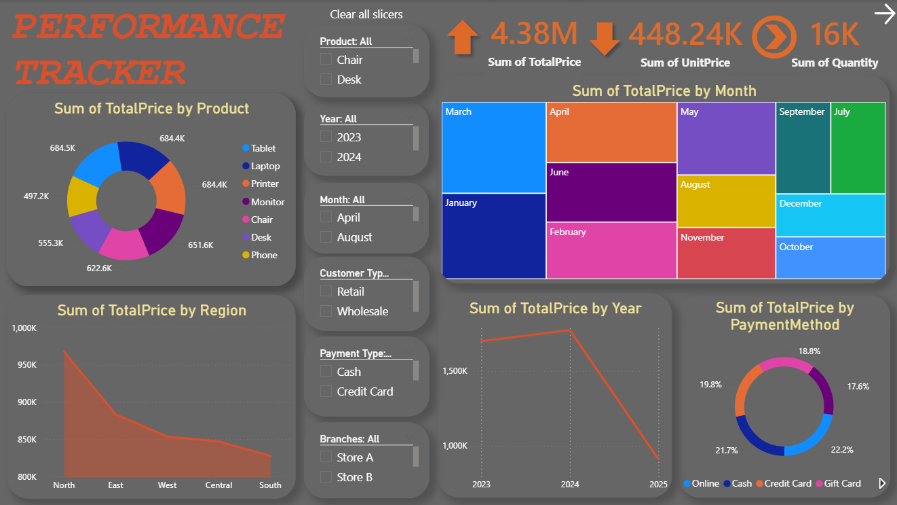
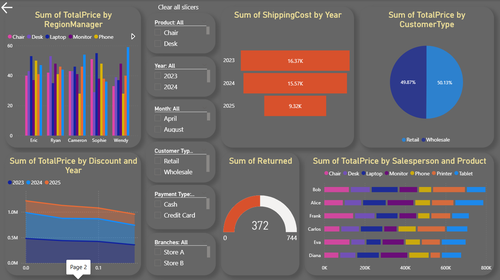

# Product-Sales-Performance-Dashboard

## 📊 Overview
• Developed an interactive Power BI dashboard to analyze product sales performance across region, product and customer segments
• Implemented data visualization techniques using charts to track trends, shipping cost, and returns
• Generated actionable insights on sales patterns and performance metrics to support data-driven business decisions

## 🚀 Key Features
- Sales analysis by region, product, and category
- Profit and revenue tracking
- Customer segmentation insights
- Trend analysis and performance metrics

## 🛠 Tools Used
Power BI, DAX, Excel

## 📈 Insights
- Identified top-performing products and regions
- Analyzed sales trends and seasonal patterns
- Evaluated profit distribution and customer behavior

## 📷 Dashboard Preview

## 📁 Files
- performance tracker.pbix 
- Product-Sales-Dashboard.xlsx
